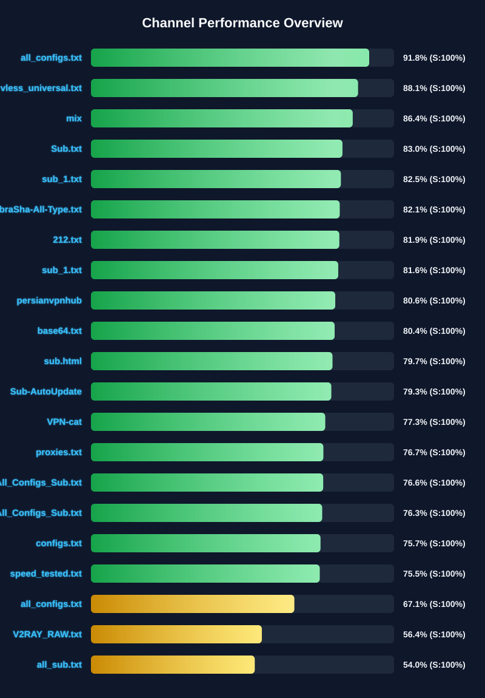

[](https://github.com/4n0nymou3/multi-proxy-config-fetcher/stargazers)
[](https://github.com/4n0nymou3/multi-proxy-config-fetcher/network/members)
[](https://github.com/4n0nymou3/multi-proxy-config-fetcher/issues)
[](https://github.com/4n0nymou3/multi-proxy-config-fetcher/blob/main/LICENSE)
[](https://github.com/4n0nymou3/multi-proxy-config-fetcher/commits)

<div dir="ltr">

# Multi Proxy Config Fetcher

[**🇺🇸English**](README.md) | [**فارسی**](README_FA.md) | [**🇨🇳中文**](README_CN.md) | [**🇷🇺Русский**](README_RU.md)

An advanced, automated proxy configuration management system that fetches, validates, tests, enriches, and filters proxy configurations from multiple sources. This project provides enterprise-grade proxy management with real-time health monitoring, geographical tagging, multi-round connectivity testing, and multi-stage security filtering.

## 🌐 Access Configurations

All proxy configurations and endpoints are available through our unified web interface:

### **[👉 Anonymous Proxy Hub - Access All Endpoints](https://4n0nymou3.github.io/Anonymous-Proxy-Hub/)**

The web interface provides:
- **36 Different Endpoints** for various use cases
- **Raw Configurations** - Unfiltered original configs
- **By Country** - Xray-tested configs grouped into 25 popular countries, each with its own subscription link
- **Xray Tested** - Configs verified with Xray core
- **Xray Load Balanced** - Smart load-balanced JSON configs
- **Xray Fragment Load Balanced** - Load-balanced JSON configs with advanced two-stage TLS fragmentation for stronger DPI resistance
- **Xray Secure** - High-security filtered configs
- **Sing-box All** - All configs in Sing-box format
- **Sing-box Tested** - Sing-box verified configs
- **Sing-box Secure** - Maximum security Sing-box configs
- **Clash All** - All configs in Clash/Mihomo format
- **Clash Tested** - Clash-compatible tested configs
- **Clash Secure** - Maximum security Clash configs

## 📊 Source Performance Monitoring

Real-time performance statistics of all configured sources (Telegram channels and URLs). This chart is automatically updated on every run.

### Quick Overview
<div align="center">
  <a href="assets/channel_stats_chart.svg">
    
  </a>
</div>

### Detailed Analytics
📊 [View Full Interactive Dashboard](https://htmlpreview.github.io/?https://github.com/4n0nymou3/multi-proxy-config-fetcher/blob/main/assets/performance_report.html)

> **Important for Forked Repositories**:  
> If you fork this repository, replace `4n0nymou3` in the dashboard link above with your GitHub username to access your own analytics dashboard.

Each source is scored based on four key metrics:
- **Reliability Score (35%)**: Success rate in fetching and updating configurations
- **Config Quality (25%)**: Ratio of valid configs to total fetched
- **Config Uniqueness (25%)**: Percentage of unique configs contributed
- **Response Time (15%)**: Server response time and availability

Sources scoring below 30% are automatically disabled to maintain system quality.

## ✨ Key Features

### Multi-Protocol Support
- **VLESS** - Lightweight VMess alternative, including Reality and XTLS Vision
- **VMess** - Popular V2Ray protocol
- **Trojan** - TLS-based proxy protocol
- **Shadowsocks** - Secure SOCKS5 proxy (AEAD ciphers only)
- **Hysteria2** - High-performance proxy protocol
- **WireGuard** - Modern, fast VPN protocol (extracted and included in the raw/tested text output only; disabled by default and not yet part of the Sing-box, Xray-balanced, or Clash conversions)
- **TUIC** - UDP-based proxy protocol (same current limitation as WireGuard above; disabled by default)

### Advanced Processing Pipeline
1. **Intelligent Fetching**
   - Supports Telegram channels, SSCONF links, and custom URLs
   - Automatic base64 decoding and format detection
   - Semantic duplicate removal (matches configs by protocol, address, port, and credentials, ignoring name or parameter order) and validation
   - Retries failed sources only on transient errors (timeouts, connection issues, HTTP 408/429/5xx); permanent errors fail fast
2. **Geographical Enrichment**
   - Automatic server location detection
   - Country flag emoji tagging
   - Support for multiple geolocation APIs
   - Intelligent fallback system
3. **Country-Based Distribution**
   - Xray-tested configs are automatically grouped by server country
   - Covers 25 popular countries, each getting its own dedicated subscription file
   - Reuses the geolocation data already collected, with no extra API calls
   - A country with no matching configs in a given run keeps its previous file untouched instead of being emptied
4. **Smart Renaming**
   - Descriptive tags with protocol details
   - Transport type identification (WS, GRPC, HTTP2, etc.)
   - Security feature detection (TLS, Reality, XTLS, Vision)
   - Port and country information
5. **Multi-Round, Two-Core Testing System**
   - Health checks using both the Xray core and the Sing-box core
   - Each core tests in multiple independent rounds (3 by default) - a config is only kept if it passes every round, filtering out unstable "flaky" configs
   - The test URL is rotated between rounds so configs aren't judged against a single destination
   - Test URLs are automatically pre-checked before each run, and any endpoint that is unreachable at that moment is skipped
   - Parallel testing with configurable workers, timeout, and test URLs
6. **Security Filtering**
   - Removes insecure encryption methods
   - Validates TLS/SSL configurations
   - Filters deprecated protocols
   - Generates separate secure endpoint files for Xray, Sing-box, and Clash
7. **Format Conversion**
   - Automatic conversion to Sing-box JSON format
   - Xray load-balanced configuration generation, including a variant with advanced two-stage TLS fragmentation
   - Clash/Mihomo YAML configuration generation
   - Full Reality and XTLS Vision support carried through every output format

## 🚀 Quick Start

### For Users (Recommended)

1. Visit the **[Anonymous Proxy Hub](https://4n0nymou3.github.io/Anonymous-Proxy-Hub/)**
2. Choose your preferred endpoint
3. Copy the URL and use it in your proxy client

### For Developers

#### Fork and Customize

1. Fork this repository
2. Edit `settings/user_settings.py` to configure:
   - Source URLs (Telegram channels, SSCONF links, etc.)
   - Enabled protocols
   - Testing parameters
   - Geolocation API preferences
3. Edit `settings/fragment_settings.py` if you want to customize the advanced TLS fragmentation used in the Fragment endpoint
4. Edit the `TARGET_COUNTRIES` dictionary in `src/country_splitter.py` if you want to change which countries get their own subscription file
5. Enable GitHub Actions in your forked repository
6. Configurations will auto-update automatically on the project's schedule

#### Local Setup

**Anonymous Wizard** is a complete step-by-step guide for installing, running and managing this project on your local system — including Termux (Android), Linux, macOS, iSH (iOS), and Windows (WSL2). Choose your preferred language:

| Language | Guide |
|----------|-------|
| Persian | [Anonymous Wizard — راهنمای فارسی](README_WIZARD_FA.md) |
| English | [Anonymous Wizard — English Guide](README_WIZARD_EN.md) |
| Chinese | [Anonymous Wizard — 中文指南](README_WIZARD_CN.md) |
| Russian | [Anonymous Wizard — Руководство на русском](README_WIZARD_RU.md) |

## ⚙️ Configuration Options

### `settings/user_settings.py`

```python
# Source URLs
SOURCE_URLS = [
    "https://t.me/s/your_channel",
    "https://raw.githubusercontent.com/user/repo/main/configs.txt",
    # Add your sources here
]

# Power Mode
USE_MAXIMUM_POWER = True  # Fetch maximum configs
SPECIFIC_CONFIG_COUNT = 0  # Used if USE_MAXIMUM_POWER is False

# Protocol Filtering
ENABLED_PROTOCOLS = {
    "wireguard://": False,
    "hysteria2://": True,
    "vless://": True,
    "vmess://": True,
    "ss://": True,
    "trojan://": True,
    "tuic://": False,
}

# Config Age Filtering
MAX_CONFIG_AGE_DAYS = 1

# Xray Testing
ENABLE_XRAY_TESTER = True
XRAY_TESTER_MAX_WORKERS = 24
XRAY_TESTER_TIMEOUT_SECONDS = 5
XRAY_TESTER_URLS = [
    'https://www.youtube.com/generate_204',
    'https://www.gstatic.com/generate_204',
    'https://cp.cloudflare.com'
]
XRAY_TESTER_ROUNDS = 3
XRAY_TESTER_BATCH_SIZE = 200

# Sing-box Testing
ENABLE_SINGBOX_TESTER = True
SINGBOX_TESTER_MAX_WORKERS = 24
SINGBOX_TESTER_TIMEOUT_SECONDS = 5
SINGBOX_TESTER_URLS = [
    'https://www.youtube.com/generate_204',
    'https://www.gstatic.com/generate_204',
    'https://cp.cloudflare.com'
]
SINGBOX_TESTER_ROUNDS = 3
SINGBOX_TESTER_BATCH_SIZE = 200

# Geolocation APIs (in priority order)
LOCATION_APIS = [
    'api.iplocation.net',
    'freeipapi.com',
    'ip-api.com',
    'ipapi.co'
]
```

Turning either tester off (`ENABLE_SINGBOX_TESTER = False` or `ENABLE_XRAY_TESTER = False`) skips that connectivity check entirely for that run - the previous file for that stage is simply copied through unchanged. This speeds up the workflow, but note that the Sing-box, Clash, and Xray Secure outputs all depend on the Sing-box test stage, so turning it off reduces their reliability even though the plain Xray and Xray Fragment outputs stay unaffected.

### `settings/fragment_settings.py`

```python
FRAGMENT_ENABLED = True

FRAGMENT_STAGE_1 = {
    "packets": "tlshello",
    "lengths": ["5", "94", "1"],
    "delays": ["0"],
    "max_split": "0"
}

FRAGMENT_STAGE_2_ENABLED = True

FRAGMENT_STAGE_2 = {
    "packets": "1-1",
    "lengths": ["109", "1"],
    "delays": ["1"],
    "max_split": "355"
}

FRAGMENT_TLS_FINGERPRINT = "unsafe"
FRAGMENT_TLS_CIPHER_SUITES = "TLS_AES_256_GCM_SHA384:TLS_CHACHA20_POLY1305_SHA256:..."
```

This controls the advanced, two-stage TLS ClientHello fragmentation applied to every config in the `xray_fragment_loadbalanced_config.json` endpoint. Adjust the stage settings, fingerprint, or cipher suites here without touching any other file.

## 📁 Output Files

The system generates multiple output files for different use cases:

- `configs/proxy_configs.txt` - Raw fetched configurations
- `configs/proxy_configs_tested.txt` - Xray-tested configurations
- `configs/location/<CC>/proxy_configs.txt` - Xray-tested configurations grouped by server country (25 country folders, e.g. `US`, `DE`, `GB`)
- `configs/singbox_configs_all.json` - All configs in Sing-box format
- `configs/singbox_configs_tested.json` - Sing-box tested configs
- `configs/singbox_configs_secure.json` - Security-filtered Sing-box configs
- `configs/xray_secure_loadbalanced_config.json` - Secure load-balanced Xray config
- `configs/clash_configs_all.yaml` - All configs in Clash/Mihomo format
- `configs/clash_configs_tested.yaml` - Clash-compatible tested configs
- `configs/clash_configs_secure.yaml` - Security-filtered Clash configs
- `configs/xray_loadbalanced_config.json` - Load-balanced Xray config
- `configs/xray_fragment_loadbalanced_config.json` - Load-balanced Xray config with advanced TLS fragmentation
- `configs/location_cache.json` - Cached geolocation data
- `configs/channel_stats.json` - Source performance metrics

## 🔄 Automation

The project uses GitHub Actions for automatic updates:

- Runs every 3 hours (8 times daily)
- Can be triggered manually via workflow_dispatch
- Automatically commits and pushes updated configurations
- Generates performance reports, charts, and a per-run pipeline summary

### GitHub Actions Workflow

The workflow performs these steps in order:
1. Fetch configs from all sources
2. Enrich with geolocation data
3. Rename with descriptive tags
4. Test with Xray core (multi-round)
5. Split tested configs by server country
6. Convert to Sing-box format
7. Test with Sing-box core (multi-round)
8. Filter for security and generate the secure Sing-box and Xray outputs
9. Generate Clash/Mihomo YAML configs
10. Generate the load-balanced Xray config
11. Generate the Fragment-enabled load-balanced Xray config
12. Update charts and reports
13. Generate the pipeline run summary
14. Commit and push changes

## 🛡️ Security Features

### Automatic Security Filtering

The system automatically removes:
- **Insecure Shadowsocks ciphers** (non-AEAD methods)
- **VMess with MD5 authentication** (deprecated alter_id)
- **Unencrypted protocols** (VLESS/Trojan without TLS)
- **Invalid TLS configurations** (insecure=true)
- **VMess with security=none**

### Secure Endpoints

Dedicated secure endpoint files contain only configurations that meet modern security standards:
- Valid TLS/SSL certificates
- Modern encryption algorithms
- No deprecated authentication methods
- Proper certificate validation

## 📈 Performance Optimization

- **Parallel processing** for faster config testing
- **Intelligent caching** for geolocation data
- **Connection pooling** for HTTP requests
- **Configurable timeouts** to balance speed and reliability
- **Smart retry logic** with exponential backoff, limited to transient errors
- **Resource cleanup** to prevent memory leaks

## 🌍 Geolocation System

### Multi-API Support

The system supports multiple free geolocation APIs with automatic fallback:

1. **api.iplocation.net** - Unlimited, fast, accurate
2. **freeipapi.com** - 60 req/min, very fast
3. **ip-api.com** - 45 req/min, reliable
4. **ipapi.co** - 1000 req/day

### Smart Detection

- Automatic URL pattern detection
- Efficient caching to minimize API calls
- Graceful degradation if APIs fail
- No API keys required

## 📊 Statistics and Monitoring

### Real-time Metrics

The system tracks comprehensive metrics for each source:
- Total configs fetched
- Valid vs invalid ratio
- Unique config contribution
- Average response time
- Success/failure rates
- Overall health score

### Visual Dashboards

- **SVG Chart** - Quick performance overview
- **Interactive HTML Report** - Detailed analytics with:
  - Active/inactive sources
  - Protocol distribution
  - Response time analysis
  - Historical trends
- **Pipeline Run Summary** - A config count for every stage and output file, shown directly on each GitHub Actions run page

## 🧪 Testing

The `tests/` folder contains an automated test suite covering the parsing, security, and testing-batch logic. It runs automatically on every push and pull request via `.github/workflows/tests.yml` and is completely separate from the scheduled config-fetching workflow, so it never affects or delays the regular automatic runs.

To run it locally:

```bash
pip install -r requirements-dev.txt
python -m pytest tests/ -v
```

## 🤝 Contributing

Contributions are welcome! Here's how you can help:

1. **Report Issues** - Found a bug? Open an issue
2. **Suggest Features** - Have an idea? Start a discussion
3. **Submit PRs** - Improvements are always appreciated
4. **Add Sources** - Know good proxy sources? Share them
5. **Improve Docs** - Help make documentation better

## ⚠️ Disclaimer

This project is provided for **educational and informational purposes only**. The developers are not responsible for:
- Any misuse of this software
- Any damage or losses incurred
- The quality or security of third-party proxy configurations
- Violations of local laws or regulations

**Users are responsible for:**
- Ensuring compliance with local laws
- Verifying the security of configurations
- Understanding the risks of using proxy services
- Respecting the terms of service of proxy providers

## 📜 License

This project is licensed under the MIT License - see the [LICENSE](LICENSE) file for details.

## 👤 About the Developer

Developed with ❤️ by **4n0nymou3**

- 🐙 GitHub: [@4n0nymou3](https://github.com/4n0nymou3)
- 🐦 Twitter/X: [@4n0nymou3](https://x.com/4n0nymou3)
- 📦 Repository: [multi-proxy-config-fetcher](https://github.com/4n0nymou3/multi-proxy-config-fetcher)

## 🙏 Acknowledgments

- **Xray-core** - High-performance proxy platform
- **Sing-box** - Universal proxy platform
- **Clash/Mihomo** - Modern proxy platform
- **GitHub Actions** - Automation infrastructure

---

<div align="center">

**[⬆ Back to Top](#-access-configurations)**

Made with 💚 by Anonymous

</div>
</div>